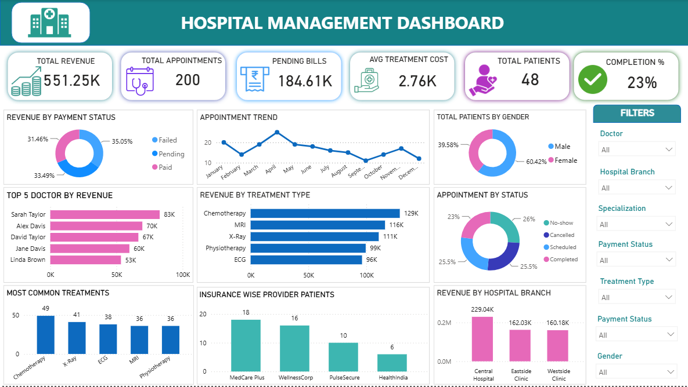

# 🏥 Hospital Management Dashboard | Power BI

An interactive **Hospital Management Dashboard** built using **Power BI** to monitor hospital operations, patient appointments, revenue, billing, treatments, and doctor performance. The dashboard provides actionable insights through interactive visualizations and KPIs to support data-driven decision-making.

---

## 📸 Dashboard Preview



---

## 📌 Project Overview

The Hospital Management Dashboard provides a comprehensive view of hospital performance by analyzing patient appointments, billing, revenue, treatments, doctors, and insurance providers. It enables healthcare administrators to identify trends, monitor KPIs, and improve operational efficiency.

---

## ✨ Dashboard Highlights

- 📊 Revenue Performance Analysis
- 📅 Appointment Trend Analysis
- 👨‍⚕️ Top 5 Doctors by Revenue
- 💰 Pending Bills Tracking
- 🩺 Most Common Treatments
- 💳 Revenue by Payment Status
- 🏥 Revenue by Hospital Branch
- 🛡️ Insurance Provider-wise Patient Analysis
- 👥 Patient Gender Distribution
- 📌 Interactive Filters for detailed analysis

---

## 📈 Key Performance Indicators (KPIs)

- Total Revenue
- Total Appointments
- Total Patients
- Pending Bills
- Average Treatment Cost
- Appointment Completion Rate

---

## 🛠️ Tools & Technologies

- Power BI
- Power Query
- DAX
- Data Modeling
- Microsoft Excel (CSV Dataset)

---

## 📂 Dataset

The project consists of the following datasets:

- Appointments
- Billing
- Doctors
- Patients
- Treatments

---

## 📁 Repository Structure

```
Hospital-Management-Dashboard-PowerBI
│
├── Dashboard
│   └── Hospital Management Dashboard.pbix
│
├── Dataset
│   ├── appointments.csv
│   ├── billing.csv
│   ├── doctors.csv
│   ├── patients.csv
│   └── treatments.csv
│
├── Image
│   └── Dashboard.png
│
└── README.md
```

---

## 💡 Skills Demonstrated

- Data Cleaning
- Data Transformation
- Data Modeling
- DAX Measures
- KPI Dashboard Design
- Business Intelligence
- Data Visualization
- Healthcare Analytics

---

## 🚀 Future Enhancements

- Time Intelligence Analysis
- Forecasting
- Drill-through Reports
- Row-Level Security (RLS)

---

## ⭐ If you found this project helpful, consider giving it a Star!
